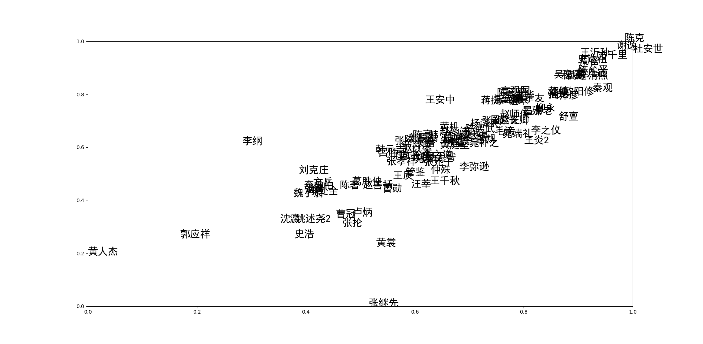
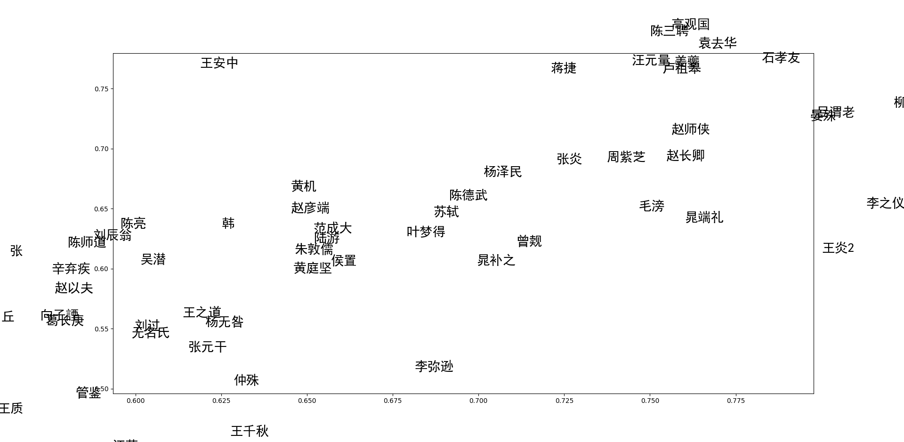

# 全宋词数据分析

这个项目尝试使用一些文本特征分析的方法，对全宋词进行数据分析。

## 样例

分析的结果。

```
**基于统计的分析
写作数量排名：
无名氏 1569
辛弃疾 629
苏轼 362
刘辰翁 354
吴文英 341
赵长卿 339
张炎 302
贺铸 282
刘克庄 269
晏几道 260

最常用的词牌名：
浣溪沙 776
水调歌头 743
鹧鸪天 657
菩萨蛮 598
满江红 549
西江月 490
临江仙 482
念奴娇 432
减字木兰花 425
沁园春 423

最常用的词汇：
东风 1332
何处 1213
人间 1132
风流 825
归来 781
西风 771
春风 768
归去 722
梅花 717
江南 714

最常用的名词：
人 4814
酒 1788
梦 1779
处 1557
风 1443
雨 1405
东风 1332
人间 1132
事 1110
君 1088

最常见的地名：
江南 714
香 494
西湖 331
长安 307
青山 277
云 264
千古 263
江山 245
夕阳 227
重阳 211

最常见的形容词：
好 1977
老 1619
新 1563
香 1182
长 1180
远 1085
红 1049
难 972
轻 942
小 929

**基于词向量的分析
与 春 相关的词：
春色 0.771809458732605
春风 0.7491874694824219
风雨 0.739784300327301
秋 0.7274118065834045
先 0.724724531173706
东风 0.7210241556167603
西风 0.68449467420578
春光 0.6749547719955444
梅花 0.673732340335846
海棠 0.668921709060669

与 天涯 相关的词：
长安 0.911306619644165
江南 0.910291850566864
何处 0.8831194639205933
悠悠 0.8802779912948608
千里 0.8695294857025146
何许 0.851921558380127
东 0.850308358669281
故人 0.846627950668335
家 0.8440274000167847
回首 0.8421926498413086

与 秋 相关的词：
微雨 0.9005503058433533
海棠 0.8943285346031189
飞絮 0.8906655311584473
落花 0.8900673985481262
飞花 0.8898453712463379
梨花 0.8877818584442139
风吹 0.882759690284729
风雨 0.873407781124115
天气 0.8722214698791504
绿阴 0.8710145950317383

与 柳 相关的词：
数声 0.9244648814201355
杨柳 0.9211939573287964
细雨 0.919588565826416
风吹 0.9115862250328064
乱 0.9105903506278992
秋千 0.905715823173523
晓 0.9018387198448181
蝉 0.9008060693740845
一声 0.8998235464096069
絮 0.8992131352424622

与 苏轼 用词相近的诗人：
根据tf-idf标准： 辛弃疾
根据word2vector标准： 赵彦端

与 欧阳修 用词相近的诗人：
根据tf-idf标准： 赵长卿
根据word2vector标准： 吕渭老

与 晏几道 用词相近的诗人：
根据tf-idf标准： 欧阳修
根据word2vector标准： 石孝友
```

对写诗数量前一百位的词人的tf-idf词向量降维结果如下：

局部结果放大：


## 运行样例

#### 依赖环境

```shell
pip install -r requirements.txt
```

#### 运行方法

当配置好环境后，这样运行样例：

```shell
python3 example.py
```

## 实现介绍

#### 词向量

首先，数据分析的一个重要部分是计算每个诗人所写的诗的集合词向量，可以看作是诗人的“文风”。关于词向量的计算，使用了两种方法：

- **tf-idf**

  通过文本中词语的的tf-idf值计算诗人的用词特征，之后计算他们的余弦相似度，推荐一篇可以参考相关知识的blog：[sklearn文本特征提取](http://blog.csdn.net/xiaoxiangzi222/article/details/53490227)。

  这种方法的的弊端在于没有考虑到词语之间的关联性，比如说"青"，"白"之间的关联程度，和"青"，"衣"之间的关联度肯定是不同的，所以引入了下一种计算词向量的方法。


- **word2vec**

  Word2Vec的基本思想是把自然语言中的每一个词，表示成一个统一意义统一维度的短向量。通过word2vec训练后，得到每个词语的词向量，再通过求和平均的方法获得文本的词向量，则可以得到每个诗人的词向量。当然，求平均肯定不是一个计算文档词向量的最优方法，此处有待改进。

  关于这个方法可以参考：[word2vec&doc2vec词向量模型](http://www.cnblogs.com/maybe2030/p/5427148.html)


#### 数据降维

为了便于显示，将计算结果降维，用到了t-SNE算法。

关于t-SNE算法可以参考：[t-SNE聚类算法实践指南](https://yq.aliyun.com/articles/70733)，其中的代码实现可以参考sklearn的官方文档：[Manifold learning on handwritten digits: Locally Linear Embedding, Isomap…](http://scikit-learn.org/stable/auto_examples/manifold/plot_lle_digits.html#sphx-glr-auto-examples-manifold-plot-lle-digits-py)


---


### 欢迎对该样例进行补充和修改！

